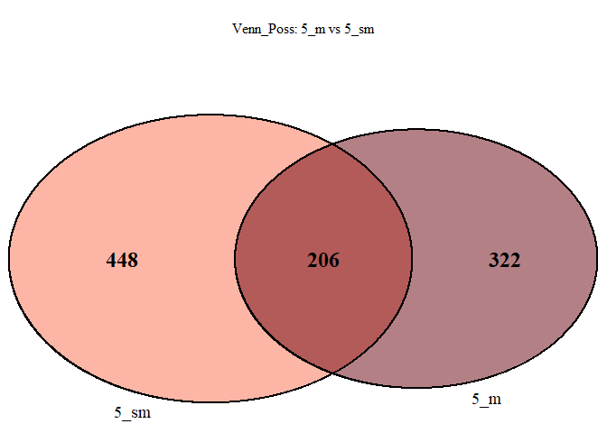
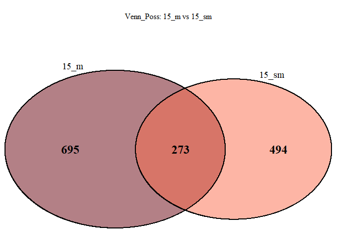
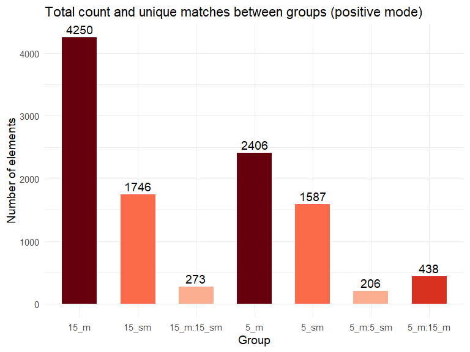
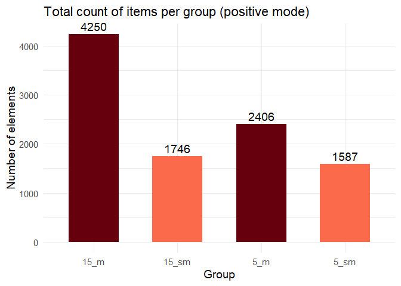
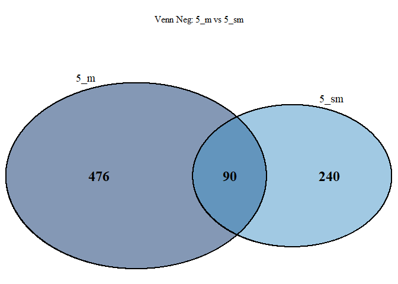
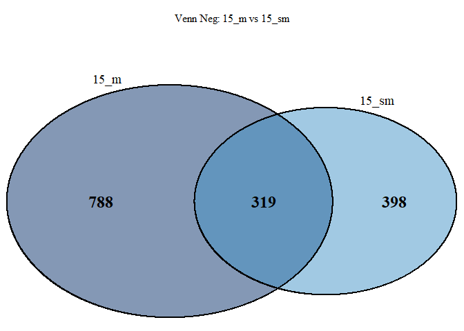
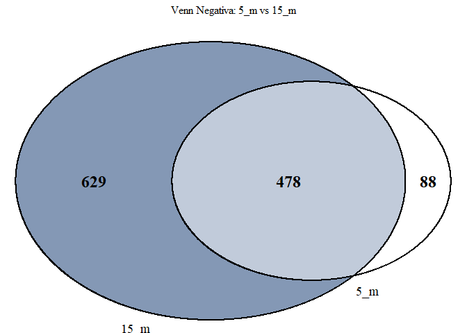
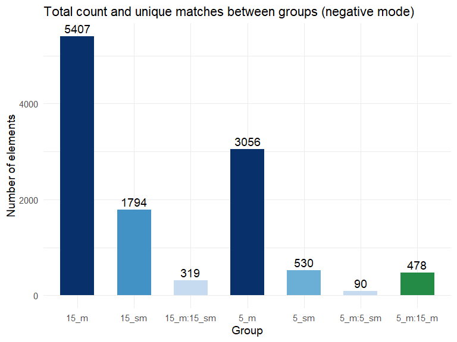
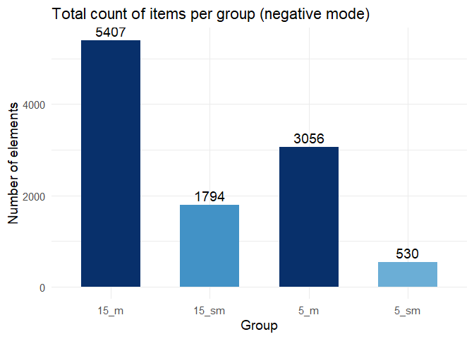

Extra Data of: LC-MS/MS profiling and characterization of caffeoylquinic
acids isomers in *Ilex guayusa* under different collection sites, plant
age, and sunlight exposure
================
Thomas Garzon
2025-05-29

``` r
# Cargar librerías necesarias
library(VennDiagram)
```

    ## Warning: package 'VennDiagram' was built under R version 4.4.3

    ## Cargando paquete requerido: grid

    ## Cargando paquete requerido: futile.logger

    ## Warning: package 'futile.logger' was built under R version 4.4.3

``` r
library(tidyverse)
```

    ## ── Attaching core tidyverse packages ──────────────────────── tidyverse 2.0.0 ──
    ## ✔ dplyr     1.1.4     ✔ readr     2.1.5
    ## ✔ forcats   1.0.0     ✔ stringr   1.5.1
    ## ✔ ggplot2   3.5.1     ✔ tibble    3.2.1
    ## ✔ lubridate 1.9.4     ✔ tidyr     1.3.1
    ## ✔ purrr     1.0.2

    ## ── Conflicts ────────────────────────────────────────── tidyverse_conflicts() ──
    ## ✖ dplyr::filter() masks stats::filter()
    ## ✖ dplyr::lag()    masks stats::lag()
    ## ℹ Use the conflicted package (<http://conflicted.r-lib.org/>) to force all conflicts to become errors

``` r
library(readxl)
library(ggplot2)

# Leer datos desde el nuevo archivo .xlsx
df <- read_excel("../Data/Data_to_venn/venn.xlsx")

# Redondear valores de Precursor (opcional)
num_decimales <- 3
df <- df %>% mutate(Precursor_round = round(Precursor, num_decimales))

# Crear subconjuntos según los niveles de la columna Iones (sin considerar Collision_energy)
list_5_m   <- df %>% filter(Iones == "5_m") %>% pull(Precursor_round)
list_5_sm  <- df %>% filter(Iones == "5_sm") %>% pull(Precursor_round)
list_15_m  <- df %>% filter(Iones == "15_m") %>% pull(Precursor_round)
list_15_sm <- df %>% filter(Iones == "15_sm") %>% pull(Precursor_round)
```

``` r
# ----------------------
# Crear diagramas de Venn
# ----------------------
venn1 <- venn.diagram(
  x = list("5_m" = unique(list_5_m), "5_sm" = unique(list_5_sm)),
  filename = NULL,
  fill = c("#67000D", "#FB6A4A"),
  alpha = 0.5, cex = 1.5, fontface = "bold",
  cat.cex = 1.2, cat.pos = c(-20, 20),
  main = "Venn_Poss: 5_m vs 5_sm"
)

grid.newpage(); grid.draw(venn1)
```

<!-- -->

``` r
# Save plot
ggsave("../Result/venn_results/Figuras/PDF/venn1_p.pdf", plot = venn1, width = 5, height = 4, units = "in", dpi = "print")
ggsave("../Result/venn_results/Figuras/PNG/venn1_p.png", plot = venn1, width = 5, height = 4, units = "in", dpi = "print")
```

``` r
venn2 <- venn.diagram(
  x = list("15_m" = unique(list_15_m), "15_sm" = unique(list_15_sm)),
  filename = NULL,
  fill = c("#67000D", "#FB6A4A"),
  alpha = 0.5, cex = 1.5, fontface = "bold",
  cat.cex = 1.2, cat.pos = c(-20, 20),
  main = "Venn_Poss: 15_m vs 15_sm"
)

grid.newpage(); grid.draw(venn2)
```

<!-- -->

``` r
# Save plot
ggsave("../Result/venn_results/Figuras/PDF/venn2_p.pdf", plot = venn2, width = 5, height = 4, units = "in", dpi = "print")
ggsave("../Result/venn_results/Figuras/PNG/venn2_p.png", plot = venn2, width = 5, height = 4, units = "in", dpi = "print")
```

``` r
venn3 <- venn.diagram(
  x = list("5_m" = unique(list_5_m), "15_m" = unique(list_15_m)),
  filename = NULL,
  fill = c("#FFFFFF", "#67000D"),
  alpha = 0.5, cex = 1.5, fontface = "bold",
  cat.cex = 1.2, cat.pos = c(-20, 20),
  main = "Venn_Poss: 5_m vs 15_m"
)

grid.newpage(); grid.draw(venn3)
```

<!-- -->

``` r
# Save plot
ggsave("../Result/venn_results/Figuras/PDF/venn3_p.pdf", plot = venn3, width = 5, height = 4, units = "in", dpi = "print")
ggsave("../Result/venn_results/Figuras/PNG/venn3_p.png", plot = venn3, width = 5, height = 4, units = "in", dpi = "print")
```

``` r
# ----------------------
# Graficos de barras: totales y compartidos
# ----------------------
# Calcular valores compartidos (únicos) entre los pares de interés
compartidos_5m_5sm <- length(intersect(unique(list_5_m), unique(list_5_sm)))
compartidos_15m_15sm <- length(intersect(unique(list_15_m), unique(list_15_sm)))
compartidos_5m_15m <- length(intersect(unique(list_5_m), unique(list_15_m)))

# Crear dataframe para graficar totales por grupo y valores compartidos
conteos_barras <- tibble(
  Grupo = c("5_m", "5_m:5_sm", "5_sm", "15_m", "15_m:15_sm", "15_sm", "5_m:15_m"),
  Conteo = c(
    length(list_5_m),
    compartidos_5m_5sm,
    length(list_5_sm),
    length(list_15_m),
    compartidos_15m_15sm,
    length(list_15_sm),
    compartidos_5m_15m
  )
)

# Reordenar los niveles del factor para que el gráfico tenga el orden deseado
conteos_barras <- conteos_barras %>%
  mutate(Grupo = factor(
    Grupo,
    levels = c("15_m", "15_sm", "15_m:15_sm", "5_m", "5_sm", "5_m:5_sm", "5_m:15_m")
  ))

# Paleta monocromática en rojo
color_rojo <- c(
  "15_m" = "#67000D",
  "15_sm" = "#FB6A4A",
  "15_m:15_sm" = "#FCAE91",
  "5_m" = "#67000D",
  "5_sm" = "#FB6A4A",
  "5_m:5_sm" = "#FCAE91",
  "5_m:15_m" = "#D7301F"
)

# Gráfico
barras1_pos <- ggplot(conteos_barras, aes(x = Grupo, y = Conteo, fill = Grupo)) +
  geom_bar(stat = "identity", width = 0.6, show.legend = FALSE) +
  geom_text(aes(label = Conteo), vjust = -0.4, size = 5) +
  scale_fill_manual(values = color_rojo) +
  labs(
    title = "Total count and unique matches between groups (positive mode)",
    y = "Number of elements", x = "Group"
  ) +
  theme_minimal(base_size = 14)


barras1_pos
```

<!-- -->

``` r
# Save plot
ggsave("../Result/venn_results/Figuras/PDF/Barras1_p.pdf", plot = barras1_pos, width = 8, height = 6, units = "in", dpi = "print")
ggsave("../Result/venn_results/Figuras/PNG/Barras1_p.png", plot = barras1_pos, width = 8, height = 6, units = "in", dpi = "print")
```

``` r
# ----------------------
# Filtrar solo los grupos de interés
# ----------------------

# Crear dataframe solo con los grupos deseados
conteos_filtrados <- conteos_barras %>%
  filter(Grupo %in% c("5_m", "5_sm", "15_m", "15_sm")) %>%
  mutate(Grupo = factor(Grupo, levels = c("15_m", "15_sm", "5_m", "5_sm")))

# Definir la paleta de colores solo para esos grupos
color_rojo_filtrado <- c(
  "15_m" = "#67000D",
  "15_sm" = "#FB6A4A",
  "5_m" = "#67000D",
  "5_sm" = "#FB6A4A"
)

# Crear el gráfico solo con los grupos seleccionados
barras_filtradas <- ggplot(conteos_filtrados, aes(x = Grupo, y = Conteo, fill = Grupo)) +
  geom_bar(stat = "identity", width = 0.6, show.legend = FALSE) +
  geom_text(aes(label = Conteo), vjust = -0.4, size = 5) +
  scale_fill_manual(values = color_rojo_filtrado) +
  labs(
    title = "Total count of items per group (positive mode)",
    y = "Number of elements", x = "Group"
  ) +
  theme_minimal(base_size = 14)

# Mostrar gráfico
barras_filtradas
```

<!-- -->

``` r
# Guardar gráfico filtrado
ggsave("../Result/venn_results/Figuras/PDF/Barras_filtradas_p.pdf", plot = barras_filtradas, width = 8, height = 6, units = "in", dpi = "print")
ggsave("../Result/venn_results/Figuras/PNG/Barras_filtradas_p.png", plot = barras_filtradas, width = 8, height = 6, units = "in", dpi = "print")
```

``` r
# Leer datos desde la segunda hoja del archivo .xlsx (modo ionización negativa)
df_neg <- read_excel("../Data/Data_to_venn/venn.xlsx", sheet = 2)

# Redondear valores de Precursor (opcional)
num_decimales <- 3
df_neg <- df_neg %>% mutate(Precursor_round_neg = round(Precursor, num_decimales))


# Crear subconjuntos por niveles de la columna Iones (sin considerar Collision_energy)
list_5_m_neg   <- df_neg %>% filter(Iones == "5_m") %>% pull(Precursor_round_neg)
list_5_sm_neg  <- df_neg %>% filter(Iones == "5_sm") %>% pull(Precursor_round_neg)
list_15_m_neg  <- df_neg %>% filter(Iones == "15_m") %>% pull(Precursor_round_neg)
list_15_sm_neg <- df_neg %>% filter(Iones == "15_sm") %>% pull(Precursor_round_neg)
```

``` r
# ----------------------
# Crear diagramas de Venn para ionización negativa
# ----------------------
venn1_neg <- venn.diagram(
  x = list("5_m" = unique(list_5_m_neg), "5_sm" = unique(list_5_sm_neg)),
  filename = NULL,
  fill = c("#08306B", "#4292C6"),
  alpha = 0.5, cex = 1.5, fontface = "bold",
  cat.cex = 1.2, cat.pos = c(-20, 20),
  main = "Venn Neg: 5_m vs 5_sm"
)
grid.newpage(); grid.draw(venn1_neg)
```

<!-- -->

``` r
ggsave("../Result/venn_results/Figuras/PDF/venn1_n.pdf", plot = venn1_neg, width = 5, height = 4, units = "in", dpi = "print")
ggsave("../Result/venn_results/Figuras/PNG/venn1_n.png", plot = venn1_neg, width = 5, height = 4, units = "in", dpi = "print")
```

``` r
venn2_neg <- venn.diagram(
  x = list("15_m" = unique(list_15_m_neg), "15_sm" = unique(list_15_sm_neg)),
  filename = NULL,
  fill = c("#08306B", "#4292C6"),
  alpha = 0.5, cex = 1.5, fontface = "bold",
  cat.cex = 1.2, cat.pos = c(-20, 20),
  main = "Venn Neg: 15_m vs 15_sm"
)
grid.newpage(); grid.draw(venn2_neg)
```

<!-- -->

``` r
ggsave("../Result/venn_results/Figuras/PDF/venn2_n.pdf", plot = venn2_neg, width = 5, height = 4, units = "in", dpi = "print")
ggsave("../Result/venn_results/Figuras/PNG/venn2_n.png", plot = venn2_neg, width = 5, height = 4, units = "in", dpi = "print")
```

``` r
venn3_neg <- venn.diagram(
  x = list("5_m" = unique(list_5_m_neg), "15_m" = unique(list_15_m_neg)),
  filename = NULL,
  fill = c("#FFFFFF", "#08306B"),
  alpha = 0.5, cex = 1.5, fontface = "bold",
  cat.cex = 1.2, cat.pos = c(-20, 20),
  main = "Venn Negativa: 5_m vs 15_m"
)
grid.newpage(); grid.draw(venn3_neg)
```

<!-- -->

``` r
ggsave("../Result/venn_results/Figuras/PDF/venn3_n.pdf", plot = venn3_neg, width = 5, height = 4, units = "in", dpi = "print")
ggsave("../Result/venn_results/Figuras/PNG/venn3_n.png", plot = venn3_neg, width = 5, height = 4, units = "in", dpi = "print")
```

``` r
# ----------------------
# Graficos de barras: totales y compartidos (ionización negativa)
# ----------------------
# Calcular valores compartidos únicos entre pares de interés
compartidos_5m_5sm_neg <- length(intersect(unique(list_5_m_neg), unique(list_5_sm_neg)))
compartidos_15m_15sm_neg <- length(intersect(unique(list_15_m_neg), unique(list_15_sm_neg)))
compartidos_5m_15m_neg <- length(intersect(unique(list_5_m_neg), unique(list_15_m_neg)))

# Crear dataframe para conteo y visualización
conteos_barras_neg <- tibble(
  Grupo = c("5_m", "5_sm", "15_m", "15_sm", "5_m:5_sm", "15_m:15_sm", "5_m:15_m"),
  Conteo = c(
    length(list_5_m_neg),
    length(list_5_sm_neg),
    length(list_15_m_neg),
    length(list_15_sm_neg),
    compartidos_5m_5sm_neg,
    compartidos_15m_15sm_neg,
    compartidos_5m_15m_neg
  )
)

# Orden correcto de los niveles del factor
conteos_barras_neg <- conteos_barras_neg %>%
  mutate(Grupo = factor(
    Grupo,
    levels = c("15_m", "15_sm", "15_m:15_sm", "5_m", "5_sm", "5_m:5_sm", "5_m:15_m")
  ))

# Paleta de azul + un verde azulado para intergrupo
color_azul <- c(
  "15_m" = "#08306B",
  "15_sm" = "#4292C6",
  "15_m:15_sm" = "#C6DBEF",
  "5_m" = "#08306B",
  "5_sm" = "#6BAED6",
  "5_m:5_sm" = "#C6DBEF",
  "5_m:15_m" = "#238B45"
)

# Gráfico final
barras1_neg <- ggplot(conteos_barras_neg, aes(x = Grupo, y = Conteo, fill = Grupo)) +
  geom_bar(stat = "identity", width = 0.6, show.legend = FALSE) +
  geom_text(aes(label = Conteo), vjust = -0.4, size = 5) +
  scale_fill_manual(values = color_azul) +
  labs(
    title = "Total count and unique matches between groups (negative mode)",
    y = "Number of elements", x = "Group"
  ) +
  theme_minimal(base_size = 14)

barras1_neg
```

<!-- -->

``` r
ggsave("../Result/venn_results/Figuras/PDF/barras1_neg.pdf", plot = barras1_neg, width = 8, height = 6, units = "in", dpi = "print")
ggsave("../Result/venn_results/Figuras/PNG/barras1_neg.png", plot = barras1_neg, width = 8, height = 6, units = "in", dpi = "print")
```

``` r
# ----------------------
# Filtrar solo los grupos individuales deseados (modo negativo)
# ----------------------

# Crear un nuevo dataframe con los grupos individuales de interés
conteos_filtrados_neg <- conteos_barras_neg %>%
  filter(Grupo %in% c("5_m", "5_sm", "15_m", "15_sm")) %>%
  mutate(Grupo = factor(Grupo, levels = c("15_m", "15_sm", "5_m", "5_sm")))

# Definir la paleta de colores para estos grupos
color_azul_filtrado <- c(
  "15_m" = "#08306B",
  "15_sm" = "#4292C6",
  "5_m" = "#08306B",
  "5_sm" = "#6BAED6"
)

# Crear gráfico con solo los grupos seleccionados
barras_filtradas_neg <- ggplot(conteos_filtrados_neg, aes(x = Grupo, y = Conteo, fill = Grupo)) +
  geom_bar(stat = "identity", width = 0.6, show.legend = FALSE) +
  geom_text(aes(label = Conteo), vjust = -0.4, size = 5) +
  scale_fill_manual(values = color_azul_filtrado) +
  labs(
    title = "Total count of items per group (negative mode)",
    y = "Number of elements", x = "Group"
  ) +
  theme_minimal(base_size = 14)

# Mostrar gráfico
barras_filtradas_neg
```

<!-- -->

``` r
# Guardar gráfico en PDF y PNG
ggsave("../Result/venn_results/Figuras/PDF/Barras_filtradas_neg.pdf", plot = barras_filtradas_neg, width = 8, height = 6, units = "in", dpi = "print")
ggsave("../Result/venn_results/Figuras/PNG/Barras_filtradas_neg.png", plot = barras_filtradas_neg, width = 8, height = 6, units = "in", dpi = "print")
```
